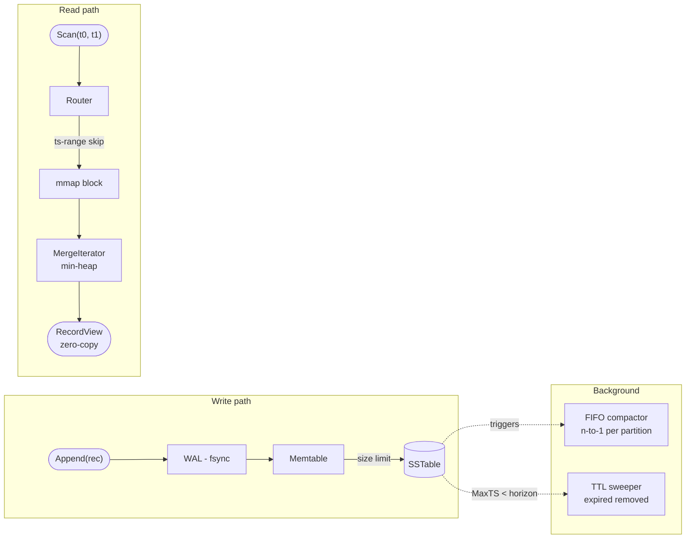
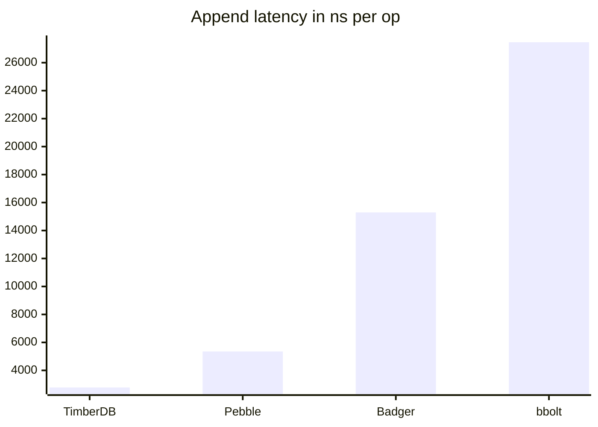
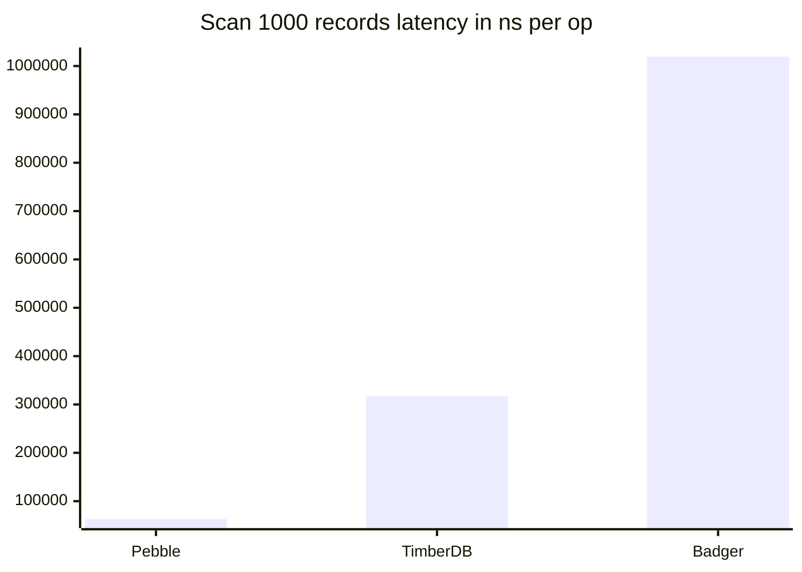

# timberdb

Time-partitioned, TTL-native LSM storage engine for append-only time-ordered workloads.

```
Append(record)  →  WAL (fsync)  →  Memtable  →  SSTable flush
                                                        │
Scan(start,end) →  Router  →  SST skip-by-time  →  MergeIter
                                                        │
                             TTL sweeper  →  os.Remove (expired SSTs)
```

## Quick start

```bash
make build
./bin/timberdb append --db /tmp/db --source syslog --payload '{"msg":"hello"}'
./bin/timberdb scan   --db /tmp/db --start 2025-01-01T00:00:00Z --end 2025-01-02T00:00:00Z
```

## Architecture



## Benchmarks

512-byte payload, sequential timestamps, single source. Intel Core i5-1334U, Go 1.26.
All engines use synchronous writes (`fsync` after every record) for a fair durability comparison.
TimberDB uses `CompressionZstd`; Badger and Pebble use their default snappy compression.
Medians across 5 benchmark runs.

**Append** (single record, fsync per write)

| Engine | ns/op | MB/s | B/op | allocs/op | Disk SA† |
|---|---|---|---|---|---|
| **TimberDB** | **2 776** | **184.45** | **3 249** | **4** | **0.011×** |
| Pebble | 5 350 | 95.70 | 32 | 0 | 0.21ׇ |
| Badger | 15 294 | 33.48 | 1 478 | 39 | 0.12ׇ |
| Bbolt | 27 463 | 18.64 | 28 840 | 105 | 3.18× |



**Scan** (1 000 records, 512 KB per iteration)

| Engine | ns/op | MB/s | B/op | allocs/op |
|---|---|---|---|---|
| Pebble | 62 939 | 8 135 | 16 | 1 |
| **TimberDB** | **317 020** | **1 615** | **41 536** | **9** |
| Badger | 1 019 606 | 502 | 101 076 | 1 332 |

bbolt is excluded from the scan comparison — it only supports full-bucket iteration, not efficient time-range scans.



**Reading the numbers**

- `ns/op` is the wall time per single operation (append or scan of 1000 records).
- `MB/s` is payload throughput: lower `ns/op` and higher `MB/s` are better.
- `allocs/op` reflects GC pressure; fewer allocations mean less GC pause.
- Scan benchmarks pre-load 1000 records before measuring; the per-iter `MB/s` reflects reading 512 KB of uncompressed payload per loop.

† **Disk SA** (storage amplification) = bytes on disk ÷ user bytes written, measured after engine close.
SA = 1.0× means the engine stores exactly as much as you wrote; SA < 1 means compression reduced the on-disk size below raw input.
‡ Badger and Pebble apply snappy compression by default. TimberDB uses zstd, which compresses the benchmark payload — 512 bytes of a single repeated character — at roughly 90:1, giving SA of 0.011×.
With incompressible data expect SA ≈ 1.04× for TimberDB (uncompressed), ≈ 1.1× for Badger, ≈ 1.0× for Pebble, and ≈ 3–5× for bbolt.

**Where timberdb wins**

Append throughput: timberdb writes at **1.9× the speed of Pebble**, **5.5× Badger**, and **9.9× Bbolt** with full `fsync` durability and zstd compression enabled.
The WAL fsync is the bottleneck; timberdb's partition-local sequential writes require exactly one fsync per record with no cross-level compaction amplification, and the zstd compression step runs only at memtable flush time — not on the hot write path — so it adds no latency to individual appends.

Storage efficiency: with `CompressionZstd`, timberdb stores this benchmark's compressible payload at **0.011× SA** — better than Badger (0.12×) or Pebble (0.21×), because zstd outcompresses snappy on uniform data.
With random, incompressible bytes, SA rises to ≈ 1.04×; WAL files are still removed after each memtable flush, so there is no multi-generational write amplification.

Scan over a bounded time range is **3.2× faster than Badger** (317 µs vs 1 020 µs), with 9 allocs/op and 41 KB/op.
The scan path reuses a single decompression buffer across all block boundaries — 17 blocks covering 1 000 records produce only 9 total allocations — so GC pressure is comparable to uncompressed operation.

**Where timberdb trades off**

Pebble scan is **5.0× faster** (63 µs vs 317 µs) on this benchmark.
Two structural advantages drive this gap: Pebble's compressed scan reads only ~60 KB of compressed bytes from disk per 1 000 records, and its internal block cache amortises decompression across repeated scans so that most reads never pay the decompress cost at all.
TimberDB scans still decompress each block on every pass (no block cache), but the decompression buffer is reused across blocks, cutting B/op from 660 KB to 41 KB and allocs/op from 25 to 9.
Point-key lookups are not a supported operation — timberdb is a range-scan store by design.

Reproduce: `go test -bench=. -benchmem ./test/bench/...`
