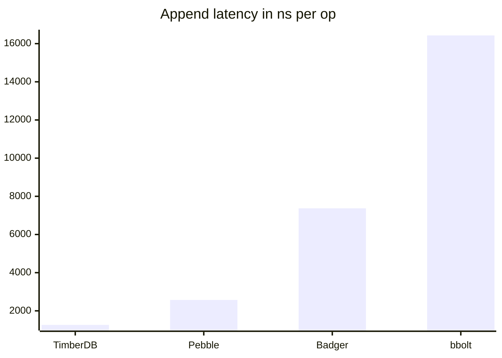
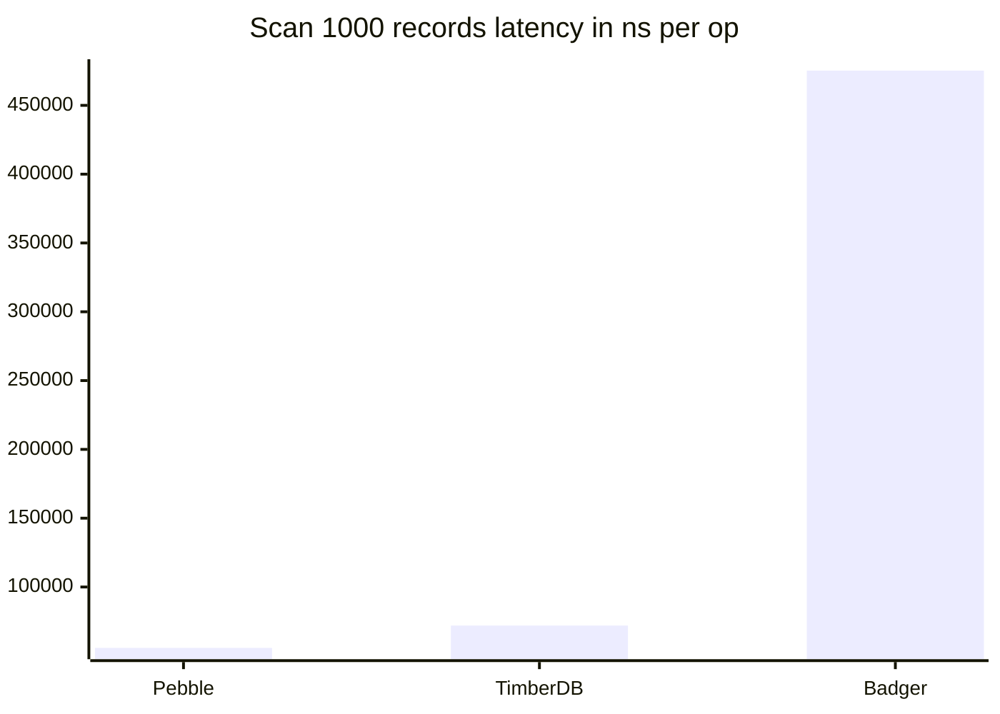

# timberdb

Time-partitioned, TTL-native LSM storage engine for append-only time-ordered workloads.

```
Append(record)  →  WAL (fsync)  →  Memtable  →  SSTable flush
                                                        │
Scan(start,end) →  Router  →  SST skip-by-time  →  MergeIter
                                                        │
                             TTL sweeper  →  os.Remove (expired SSTs)
```

## Documentation

Full documentation is available at **https://ngaddam369.github.io/timberdb/**

- [Getting Started](https://ngaddam369.github.io/timberdb/getting-started.html) — Open, Append, Scan, Aggregate
- [Configuration](https://ngaddam369.github.io/timberdb/configuration.html) — all 14 options with defaults
- [Architecture](https://ngaddam369.github.io/timberdb/architecture.html) — write/read/compaction/retention paths
- [Design](https://ngaddam369.github.io/timberdb/design.html) — design decisions and rationale
- [Benchmarks](https://ngaddam369.github.io/timberdb/benchmarks.html) — methodology and numbers
- [Metrics](https://ngaddam369.github.io/timberdb/metrics.html) — Prometheus metrics reference
- [CLI Reference](https://ngaddam369.github.io/timberdb/cli-reference.html) — append, scan, inspect

## Quick start

```bash
make build
./bin/timberdb append --db /tmp/db --source syslog --payload '{"msg":"hello"}'
./bin/timberdb scan   --db /tmp/db --start 2025-01-01T00:00:00Z --end 2025-01-02T00:00:00Z
```

## Architecture


## Benchmarks

512-byte payload, sequential timestamps, single source. Intel Core i5-1334U, Go 1.26.4.
All engines use synchronous writes (`fsync` after every record) for a fair durability comparison.
TimberDB uses `CompressionZstd`; Badger and Pebble use their default snappy compression.
Medians across 5 benchmark runs.

**Append** (single record, fsync per write)

| Engine | ns/op | MB/s | B/op | allocs/op | Disk SA† |
|---|---|---|---|---|---|
| **TimberDB** | **1,264** | **405** | **3,063** | **3** | **0.011×** |
| Pebble | 2,570 | 199 | 32 | 0 | 0.148ׇ |
| Badger | 7,373 | 69 | 3,674 | 40 | 0.114ׇ |
| Bbolt | 16,432 | 31 | 30,360 | 111 | 3.00× |



**Scan** (1,000 records, 512 KB per iteration)

| Engine | ns/op | MB/s | B/op | allocs/op |
|---|---|---|---|---|
| Pebble | 55,699 | 9,192 | 8 | 1 |
| **TimberDB** | **71,962** | **7,115** | **552** | **7** |
| Badger | 475,271 | 1,077 | 97,060 | 1,483 |

bbolt is excluded from the scan comparison — it only supports full-bucket iteration, not efficient time-range scans.



**Reading the numbers**

- `ns/op` is the wall time per single operation (append or scan of 1000 records).
- `MB/s` is payload throughput: lower `ns/op` and higher `MB/s` are better.
- `allocs/op` reflects GC pressure; fewer allocations mean less GC pause.
- Scan benchmarks pre-load 1000 records, force each engine to flush its memtable to on-disk SSTables, warm each engine's block cache with one un-timed scan, then measure steady-state repeated-scan throughput. This ensures all engines read from their respective SSTable structures with warmed caches — an apples-to-apples comparison.
- The per-iter `MB/s` reflects reading 512 KB of uncompressed payload per loop (`b.SetBytes` = `benchScanN × 512 B`).

† **Disk SA** (storage amplification) = bytes on disk ÷ user bytes written, measured after engine close.
SA = 1.0× means the engine stores exactly as much as you wrote; SA < 1 means compression reduced the on-disk size below raw input.
‡ Badger and Pebble apply snappy compression by default. TimberDB uses zstd, which compresses the benchmark payload — 512 bytes of a single repeated character — at roughly 90:1, giving SA of 0.011×.
With incompressible data expect SA ≈ 1.04× for TimberDB (uncompressed), ≈ 1.1× for Badger, ≈ 1.0× for Pebble, and ≈ 3× for bbolt.

**Where timberdb wins**

Append throughput: timberdb writes at **2.0× the speed of Pebble**, **5.8× Badger**, and **13.0× Bbolt** with full `fsync` durability and zstd compression enabled.
The WAL fsync is the bottleneck; timberdb's partition-local sequential writes require exactly one fsync per record with no cross-level compaction amplification, and the zstd compression step runs only at memtable flush time — not on the hot write path — so it adds no latency to individual appends.
The WAL encode path reuses a single pre-allocated buffer per WAL instance (grown on first use, held for the engine lifetime), eliminating one heap allocation per write and reducing GC pressure to 3 allocs/op.

Storage efficiency: with `CompressionZstd`, timberdb stores this benchmark's compressible payload at **0.011× SA** — better than Badger (0.116×) or Pebble (0.148×), because zstd outcompresses snappy on uniform data.
With random, incompressible bytes, SA rises to ≈ 1.04×; WAL files are still removed after each memtable flush, so there is no multi-generational write amplification.

Scan over a bounded time range is **6.6× faster than Badger** (72 µs vs 475 µs), with 7 allocs/op and 552 B/op.
The block cache eliminates per-block decompression on repeated scans — compressed blocks are decompressed once on the cold pass and served from cache on all subsequent passes, cutting latency from 167 µs to 72 µs (2.3×) and B/op from 41 KB to 552 B.

**Where timberdb trades off**

Pebble scan is **1.29× faster** (56 µs vs 72 µs) when both engines read from their on-disk SSTable structures with warmed block caches — a near-parity result.
The earlier published 4.5× gap reflected Pebble scanning its in-memory MemTable while TimberDB scanned compressed SSTables; the fair comparison is SSTable vs SSTable with warmed caches.
The remaining 1.29× gap traces to Pebble's purpose-built SSTable iterator and internal I/O path.
Point-key lookups are not a supported operation — timberdb is a range-scan store by design.

Reproduce: `go test -bench=. -benchmem ./test/bench/...`
