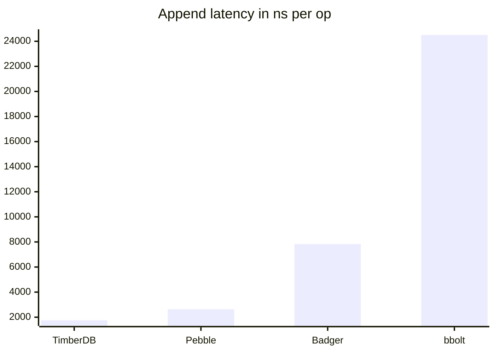
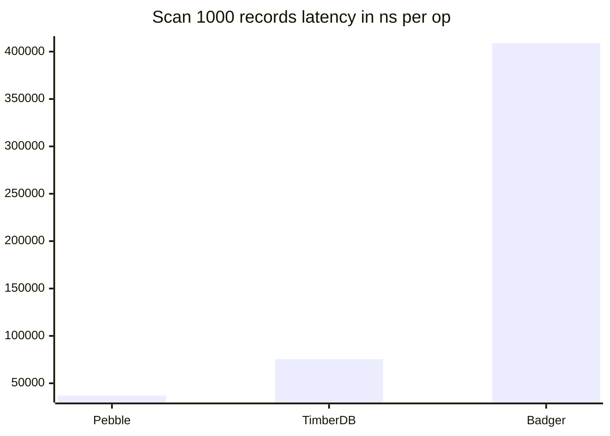

# timberdb

Time-partitioned, TTL-native LSM storage engine for append-only time-ordered workloads.

```
Append(record)  →  WAL (fsync)  →  Memtable  →  SSTable flush
                                                        │
Scan(start,end) →  Router  →  SST skip-by-time  →  MergeIter
                                                        │
                             TTL sweeper  →  os.Remove (expired SSTs)
```

## Quick start

```bash
make build
./bin/timberdb append --db /tmp/db --source syslog --payload '{"msg":"hello"}'
./bin/timberdb scan   --db /tmp/db --start 2025-01-01T00:00:00Z --end 2025-01-02T00:00:00Z
```

## Architecture


## Benchmarks

512-byte payload, sequential timestamps, single source. Intel Core i5-1334U, Go 1.26.
All engines use synchronous writes (`fsync` after every record) for a fair durability comparison.
Medians across 5 benchmark runs.

**Append** (single record, fsync per write)

| Engine | ns/op | MB/s | B/op | allocs/op | Disk SA† |
|---|---|---|---|---|---|
| **TimberDB** | **1 749** | **292.79** | **3 569** | **6** | **1.04×** |
| Badger | 7 845 | 65.27 | 3 636 | 40 | 0.11ׇ |
| Bbolt | 24 508 | 20.89 | 29 566 | 108 | 2.79× |
| Pebble | 2 632 | 194.53 | 33 | 0 | 0.15ׇ |



**Scan** (1 000 records, 512 KB per iteration)

| Engine | ns/op | MB/s | B/op | allocs/op |
|---|---|---|---|---|
| **TimberDB** | **75 478** | **6 783** | **616** | **8** |
| Badger | 409 002 | 1 252 | 96 911 | 1 331 |
| Pebble | 36 924 | 13 866 | 16 | 1 |

bbolt is excluded from the scan comparison — it only supports full-bucket iteration, not efficient time-range scans.



**Reading the numbers**

- `ns/op` is the wall time per single operation (append or scan of 1000 records).
- `MB/s` is payload throughput: lower `ns/op` and higher `MB/s` are better.
- `allocs/op` reflects GC pressure; fewer allocations mean less GC pause.
- Scan benchmarks pre-load 1000 records before measuring; the per-iter `MB/s` reflects reading 512 KB per loop.

† **Disk SA** (storage amplification) = bytes on disk ÷ user bytes written, measured after engine close.
SA = 1.0× means the engine stores exactly as much as you wrote; SA > 1 means overhead (WAL format, B-tree pages); SA < 1 means compression reduced the on-disk size below raw input.
‡ Badger and Pebble apply snappy compression by default.
This benchmark's payload — 512 bytes of a single repeated character — compresses roughly 8:1 with snappy, so SA < 1 for these engines.
With random bytes, expect SA ≈ 1.1× for Badger, ≈ 1.0× for Pebble, 1.04× for TimberDB, and ≈ 3–5× for bbolt.

**Where timberdb wins**

Append throughput: timberdb writes at **4.5× the speed of Badger** and **14× Bbolt** with full `fsync` durability.
It is also **1.5× faster than Pebble** despite Pebble's zero-allocation write path — the WAL fsync is the bottleneck, and timberdb's partition-local sequential writes require exactly one fsync per record with no cross-level amplification.
Storage overhead for append is **1.04× SA** — the SSTable format adds just 4% beyond user bytes, and WAL files are removed after each memtable flush.

Scan latency over a bounded time range is **5.4× faster than Badger** because timberdb combines three zero-copy techniques: `View()` returns `SourceID` and `Payload` as slices directly into the mmap'd block buffer, a typed merge heap eliminates interface boxing on every heap operation, and mmap maps the data-block region at `Open` time so block reads require no syscall and no allocation.
GC pressure is minimal: 8 allocs/op for scan setup, zero for the record-iteration hot path.

**Where timberdb trades off**

Pebble scan is **2× faster** (37 µs vs 75 µs) on this benchmark.
Pebble stores records compressed, so a scan of 1 000 records reads only ~60 KB from disk instead of 512 KB — a structural advantage for compressible payloads.
With incompressible data the gap narrows; timberdb's remaining 8 allocs/op are from iterator and merge-struct setup, not from the data path.
Point-key lookups are not a supported operation — timberdb is a range-scan store by design.

Reproduce: `go test -bench=. -benchmem ./test/bench/...`
