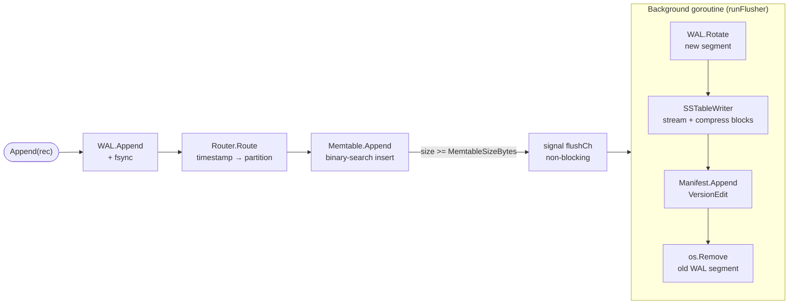
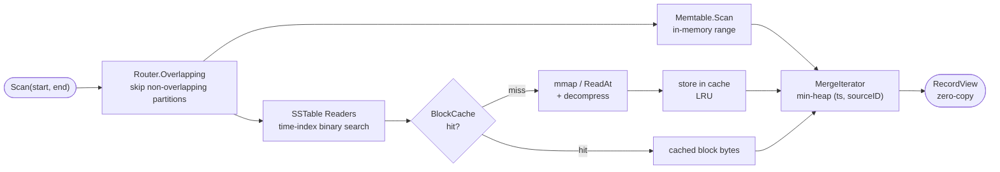
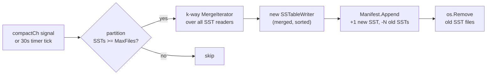
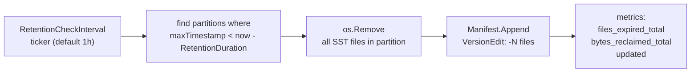

# Architecture

timberdb is organized around four independent paths: write, read, compaction, and retention. Each path is described below with a diagram, followed by detail on the SSTable format, WAL, block cache, and memory mapping.

---

## Write path

Every call to `Append` follows this sequence synchronously on the caller's goroutine through the WAL write. The flush to SSTable happens asynchronously in a background goroutine.



**Step by step:**

1. **WAL write** — `WAL.Append(rec)` encodes the record into a length-prefixed, CRC32-protected frame and writes it to the current WAL segment. With `SyncAlways`, an fsync follows immediately. The record is now durable even if the process crashes before the next step.

2. **Routing** — `Router.Route(timestamp)` maps the timestamp to its time-partition window (e.g. the partition covering `[2025-06-20T14:00, 2025-06-20T15:00)`). If no partition exists for that window yet, one is created.

3. **Memtable insert** — `Memtable.Append(rec)` performs a binary-search insertion into a sorted slice ordered by `(timestamp, sourceID)`. Records that arrive in chronological order (the common case) always append to the end — O(1) in practice.

4. **Flush trigger** — when the partition's memtable byte count exceeds `MemtableSizeBytes`, a non-blocking send to `flushCh` is made. If a flush is already in progress, the signal is dropped — the next flush will pick up the accumulated records.

5. **Background flush** — `flushPartition()` runs in `runFlusher()`. It atomically snapshots the memtable (new writes go to a fresh memtable immediately), rotates the WAL to a new segment, streams all snapshot records through `SSTableWriter`, appends a `VersionEdit` to the manifest, and only then removes the old WAL segment. The old WAL is deleted last — this ordering ensures that if the process crashes mid-flush, the WAL can be replayed on recovery.

---

## Read path

`Scan` assembles per-partition iterators and merges them into a single sorted stream.



**Step by step:**

1. **Partition filter** — `Router.Overlapping(start, end)` returns only partitions whose window overlaps the query range. Partitions outside the range are not opened or read at all.

2. **Per-partition iterators** — for each overlapping partition, two kinds of iterators are created:
   - A **memtable iterator** over the in-memory sorted slice (handles records not yet flushed to disk)
   - An **SSTable reader iterator** for each SSTable file in the partition

3. **SSTable time-index skip** — the SSTable reader loads the time index (one entry per block: `minTimestamp, blockOffset, blockSize`) and binary-searches for the first block whose `minTimestamp >= start`. Blocks before the query range are never read. Blocks past `end` cause the iterator to stop early.

4. **Block read with cache** — when a block is needed, the reader checks the block cache first (keyed by `(filepath, blockOffset)`). On a miss, it reads the block bytes via mmap (or `ReadAt` if the block is outside the mmap region), decompresses if needed, verifies CRC32, and stores the decompressed payload in the cache.

5. **MergeIterator** — a min-heap over all per-partition iterators orders records globally by `(timestamp, sourceID)`. The heap stores only `(timestamp, sourceID, iteratorIndex)` — never the record bytes — so no data is copied until `View()` is called.

6. **Zero-copy view** — `it.View()` delegates directly to the currently-winning iterator's `View()`. For SSTable iterators, this returns slices directly into the cached block payload. No allocations occur on the hot iteration path.

---

## Compaction path

Background compaction merges multiple SSTable files within a partition into a single file, keeping the file count bounded and improving scan performance.



Compaction is triggered immediately after every flush (via `compactCh`) and also on a background `CompactionCheckInterval` timer, which catches partitions that were not compacted immediately. Because timberdb uses FIFO compaction (all files in a partition merge into one), there is no write amplification from multi-level compaction — each record is written to disk at most twice: once during the initial flush, and once during the compaction merge.

---

## Retention path

The TTL sweeper removes entire partitions whose data has expired beyond `RetentionDuration`.



Retention deletes at partition granularity — an entire partition is removed once its newest record (`maxTimestamp`) is older than the retention horizon. This means the actual data retained may be up to one `PartitionDuration` older than the cutoff.

---

## SSTable format

timberdb uses three SSTable versions, all readable simultaneously:

### Version 0 (v0) — uncompressed row blocks

The original format. No header. Data blocks store records in row format:

```
RecordCount (4 bytes)
  Timestamp  (8 bytes)
  SrcIDLen   (4 bytes)
  SourceID   (variable)
  PayloadLen (4 bytes)
  Payload    (variable)
  ... (repeated RecordCount times)
CRC32 (4 bytes, covers the entire block)
```

An 80-byte footer at the end of the file contains the time index offset, source index offset, min/max timestamps, record count, and a `TIMBERDB` magic number.

### Version 1 (v1) — compressed row blocks

Adds a 16-byte header at the start of the file:

```
headerMagic (8 bytes: "TMRBHDR1" little-endian)
version     (2 bytes: 1)
flags       (2 bytes: lower byte = CompressionType)
reserved    (4 bytes: zero)
```

Data blocks have the same row format as v0 but are compressed with Zstd or Snappy. The reader decompresses the block before parsing records.

### Version 2 (v2) — columnar blocks

Same 16-byte header as v1 with `version = 2`. Data blocks use a columnar layout that separates timestamps, source IDs, and payloads into contiguous sections:

```
RecordCount     (4 bytes)
SrcIDsSize      (4 bytes)   ← size of the SourceIDs section
PayloadsSize    (4 bytes)   ← size of the Payloads section
Timestamps      (RecordCount × 8 bytes, fixed-width)
SourceIDs       (SrcIDsSize bytes: Len(4) | SourceID per record)
Payloads        (PayloadsSize bytes: Len(4) | Payload per record)
CRC32           (4 bytes)
```

Because timestamps are at a fixed offset, `Aggregate()` can read only the timestamps section per block — it never touches SourceIDs or Payloads, which dramatically reduces I/O for count and rate aggregations over large time ranges.

V2 blocks can also be compressed: the entire columnar block (after the `RecordCount` / `SrcIDsSize` / `PayloadsSize` header) is compressed before being written.

---

## WAL (Write-Ahead Log)

The WAL is a single append-only file per engine instance. Records are written in a simple binary format:

```
CRC32     (4 bytes, covers Len + body)
Len       (4 bytes)
Timestamp (8 bytes)
SrcIDLen  (4 bytes)
SourceID  (variable)
PayloadLen(4 bytes)
Payload   (variable)
```

WAL files are named `wal-000001.wal`, `wal-000002.wal`, etc. A new WAL segment is created on each memtable flush. The old segment is deleted only after the manifest records the new SSTable — ensuring that a crash mid-flush can always be recovered by replaying the WAL.

**Sync modes:**

| Mode | Behaviour |
|---|---|
| `SyncAlways` | `fsync` after every `Append` call |
| `SyncPeriodic` | A background goroutine calls `fsync` every 200ms |
| `SyncNever` | Writes are buffered; the OS flushes at its own discretion |

---

## Block cache

The block cache is a size-bounded LRU cache, keyed by `(filepath, blockOffset)`. It stores decompressed block payloads — the raw bytes of the record section after the block header and before the CRC — so that a block only needs to be decompressed once no matter how many times it is scanned.

**Policy:**
- Only compressed blocks (v1/v2) are cached. Uncompressed v0 blocks are never cached.
- Entries are stored after CRC verification — corrupted blocks are never cached.
- Eviction uses strict LRU: the least-recently-accessed block is evicted first.
- The cache is per-engine-instance, not global. Multiple engines in the same process have independent caches.
- `BlockCacheBytes = 0` disables the cache entirely.

---

## Memory-mapped I/O

On Linux and Unix systems, the data blocks region of each SSTable (`[0, timeIndexOffset)`) is memory-mapped via `golang.org/x/sys/unix.Mmap` with `PROT_READ | MAP_SHARED`. An `MADV_SEQUENTIAL` hint is also applied so the kernel can aggressively prefetch pages for sequential block scans. This eliminates per-block `read()` syscalls and lets the kernel I/O subsystem manage page eviction.

On Windows, mmap is not used; blocks are read via `ReadAt()` instead.

mmap is implemented in pure Go via `golang.org/x/sys/unix` — there is no CGo in timberdb.
