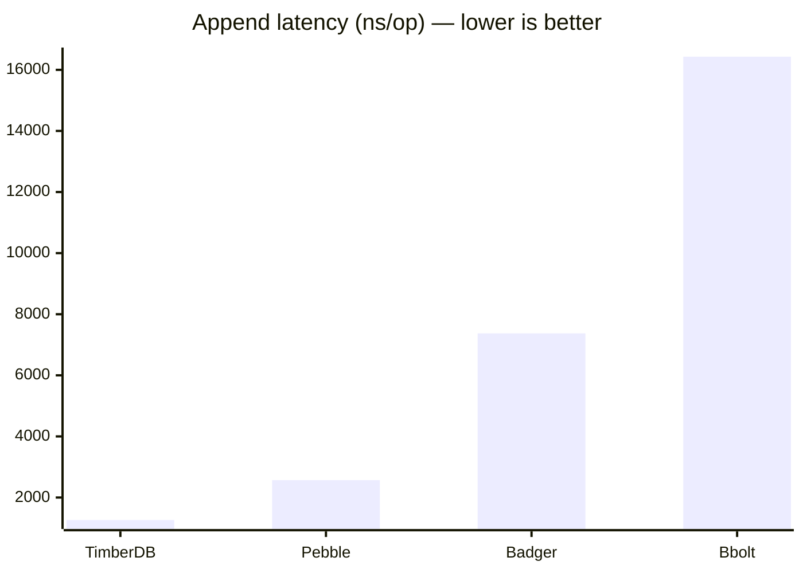
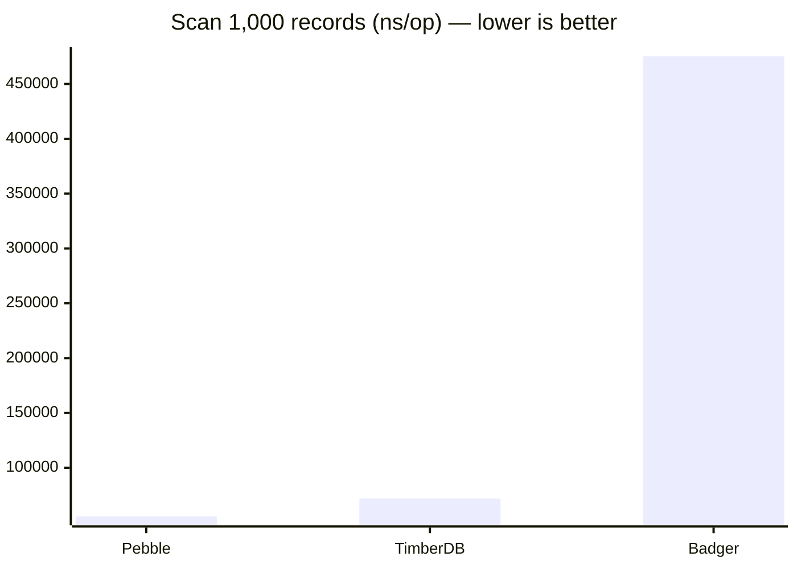

# Benchmarks

## Setup

**Hardware:** Intel Core i5-1334U (12-core, 12th gen) · Linux  
**Go version:** 1.26.4  
**Payload:** 512 bytes (single repeated character) per record  
**Timestamps:** sequential (monotonically increasing, 1ms apart)  
**Source:** single source ID  
**Numbers:** medians across 5 benchmark runs

All engines use **synchronous writes** (`fsync` after every record) for a fair durability comparison.

---

## Append throughput

Single-record append with one `fsync` per write:

| Engine | ns/op | MB/s | B/op | allocs/op | Disk SA† |
|---|---|---|---|---|---|
| **TimberDB** | **1,264** | **405** | **3,063** | **3** | **0.011×** |
| Pebble | 2,570 | 199 | 32 | 0 | 0.148ׇ |
| Badger | 7,373 | 69 | 3,674 | 40 | 0.114ׇ |
| Bbolt | 16,432 | 31 | 30,360 | 111 | 3.00× |



**Why timberdb is fastest at appends:**

The WAL fsync is the bottleneck for all engines. timberdb minimizes every other cost:
- One sequential write per record (WAL only); the SSTable write happens at flush time — not on the hot path.
- The WAL encoder reuses a single pre-allocated buffer per WAL instance, eliminating one heap allocation per write. That's why allocs/op = 3 (encode into buffer, write to bufio, and one indirect).
- No cross-partition coordination — each record goes directly to its partition's memtable via a simple map lookup.

---

## Scan throughput

1,000 records (512 KB payload per iteration). All engines pre-loaded with records and flushed to their on-disk SSTable structures before timing.

| Engine | ns/op | MB/s | B/op | allocs/op |
|---|---|---|---|---|
| Pebble | 55,699 | 9,192 | 8 | 1 |
| **TimberDB** | **71,962** | **7,115** | **552** | **7** |
| Badger | 475,271 | 1,077 | 97,060 | 1,483 |



bbolt is excluded from scan comparisons — it only supports full-bucket iteration, not efficient time-range scans.

**Where timberdb wins:**

timberdb scan is **6.6× faster than Badger** (72 µs vs 475 µs) with 7 allocs/op and only 552 B/op. Badger's scan allocates nearly 100 KB per iteration and takes 1,483 allocations — reflecting its per-key value fetch and prefetch buffer overhead.

The block cache cuts repeated-scan latency by **2.3×** (from 167 µs cold to 72 µs warm): compressed blocks are decompressed once on the first scan and served from the LRU cache on all subsequent scans, dropping both I/O and CPU cost.

**Where timberdb trades off:**

Pebble scan is **1.29× faster** (56 µs vs 72 µs). This is a near-parity result for two engines reading from their respective SSTable structures with warmed caches. The gap reflects Pebble's purpose-built SSTable iterator and internal I/O path.

---

## Benchmark methodology

The scan benchmarks are careful to make an apples-to-apples comparison. Without this care, different engines end up measuring different things.

**The problem:** 1,000 × 512-byte records = 512 KB of data. Badger's default memtable is 64 MB and Pebble's is also large — without an explicit flush, both engines scan their in-memory MemTable, not their SSTable structures. TimberDB flushes to SSTables on close. Naively, this gives Badger and Pebble an unfair memory-speed advantage.

**The fix:**
1. Write 1,000 records to each engine.
2. Force each engine to flush its MemTable to SSTables on disk:
   - **TimberDB:** `engine.Close()` then reopen (Close flushes all memtables)
   - **Badger:** `db.Close()` then reopen (Close flushes all MemTables)
   - **Pebble:** `db.Flush()` (explicit MemTable → L0 SSTable flush)
3. Run one **un-timed warm-up scan** to pre-warm each engine's block cache.
4. Call `b.ResetTimer()`, then measure steady-state repeated-scan throughput.

The MB/s figure reflects **user-data payload throughput**: `b.SetBytes(benchScanN × 512)`.

Each iteration verifies that exactly `benchScanN` records were returned, so a broken iterator returning 0 results would fail immediately rather than appear faster.

**Reproduce:**
```bash
go test -bench=. -benchmem ./test/bench/...
```

For median across 5 runs:
```bash
go test -bench=. -benchmem -count=5 ./test/bench/...
```

---

## Storage amplification

Storage amplification (SA) = bytes on disk after close ÷ bytes of user data written.

SA = 1.0× means the engine stores exactly as much as you wrote. SA < 1× means compression reduced the on-disk size below raw input.

| Engine | SA (512-byte repeated char) | SA (incompressible random bytes) |
|---|---|---|
| **TimberDB (zstd)** | **0.011×** | ~1.04× |
| Badger (snappy default) | 0.114× | ~1.1× |
| Pebble (snappy default) | 0.148× | ~1.0× |
| Bbolt (no compression) | 3.00× | ~3.0× |

† SA is measured after `engine.Close()`, which flushes WAL → SSTable and removes temporary files. The WAL is not counted in SA since it is deleted after each flush.

‡ Badger and Pebble apply snappy compression by default. The benchmark payload — 512 bytes of a single repeated character — compresses at roughly 90:1 with zstd and roughly 10:1 with snappy. With **incompressible data** (random bytes), expect SA ≈ 1.04× for TimberDB, ≈ 1.1× for Badger, ≈ 1.0× for Pebble, and ≈ 3.0× for Bbolt.

---

## Reading the numbers

- **ns/op** — wall time per single operation (one append, or one scan of 1,000 records). Lower is better.
- **MB/s** — user-data payload throughput. Higher is better.
- **B/op** — heap bytes allocated per operation by the Go runtime. Lower = less GC pressure.
- **allocs/op** — number of distinct heap allocations per operation. Lower = less GC pressure.
- **SA** — storage amplification. SA < 1 means compression produced a smaller file than raw input.
